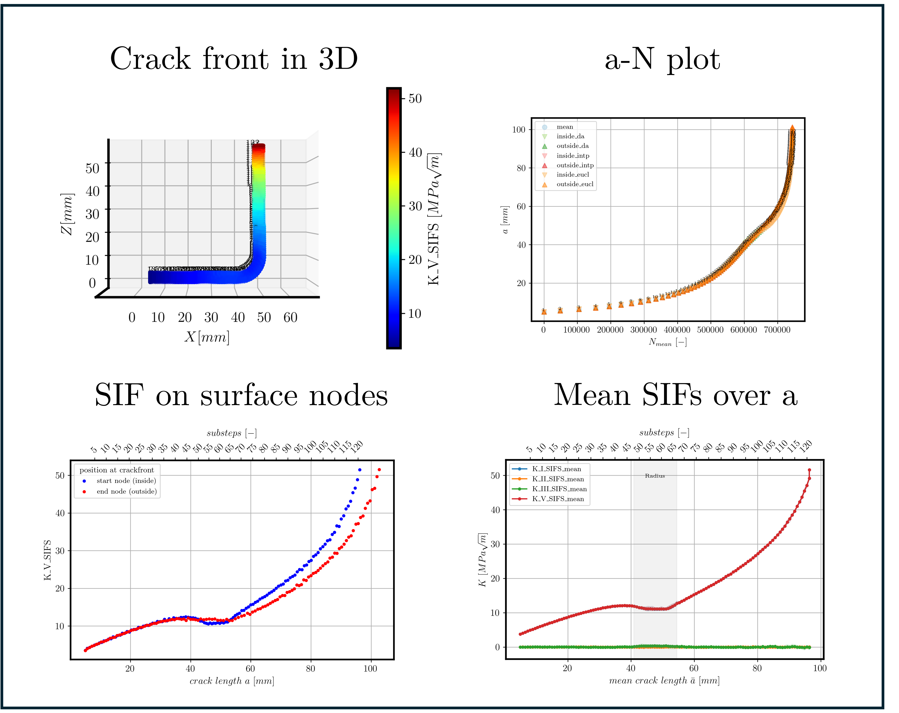

# Numerical Simulations of Stress Intensity Factors and Fatigue Life in L-Shaped Sheet Profiles

This repository provides a collection of examples demonstrating the use of **ANSYS**s proprietary Crack Growth Algorithm **SMART** (Separating, Morphing, and Adaptive Remeshing Technology) for 3D Finite Element Method (FEM) simulations. 
The code makes use of the **PyMAPDL** library to interact with **ANSYS Mechanical APDL** in a pythonic way.
## Usage

### Main dependencies
*  <a href="https://www.python.org/downloads/release/python-311/" target="_blank">Python 3.11</a>
* <a href="https://www.ansys.com/" target="_blank">Ansys Mechanical</a>: 
Model building and solving was done in ANSYS Mechanical APDL 2022 R2.
*  <a href="https://mapdl.docs.pyansys.com/" target="_blank">PyMAPDL</a>: 
The API to interact with ANSYS Mechanical APDL in a pythonic way.

### Installation

1. Create a virtual environment of Python 3.11 and activate it.
2. Install the required packages using the following command:
```shell
pip install -r requirements.txt
```

The repository contains the following folders:
* `pyMapdl`: The base class to setup similar simulations (`simulation.py`) and the L-section specific class (`pySMART_LSection.py`). The class `SMARTLSection` is sufficient to reproduce the raw data of the article.
* `utility`: Utility functions such as exporting the results to a CSV file.


### Getting started
To run a simulation, follow the minimal example in `01_LSection_MinExample.py`.
For larger parameter studies, we recommend the incorporation into a custom pipeline, e.g. like in the example in `02_LSection_MinBatchProcessing.py`.

### Data Export
The folder structure is organized as follows:

```
Results
├── Experiment_1                  # Data for the first experiment
│   ├── crackdata                 # Contains CINT evaluations for each substep (crack growth data)
│   ├── input                     # Final parameter set used as input for PyANSYS and the .inp file for MAPDL
│   ├── misc                      # Additional auxiliary files and info
│   ├── nodemaps                  # Exported nodemaps for each substep (crack growth increment)
│   └── postprocessed             # Plots, visualizations, and other postprocessed results (custom)
├── Experiment_2                  # Data for the second experiment
│   ├── crackdata                
│   ├── ...  
├── ...       
```

#### Nodemap file format
Each row represents a finite-element node exported from Ansys.  
All values are semicolon-separated. The format can be found in utility/pattern.py.

| Column | Meaning | Typical units* |
| ------ | ------- | -------------- |
| `ID`   | Unique node identifier | — |
| `x, y, z` | Global coordinates | mm |
| `ux, uy, uz` | Nodal displacements | mm |
| `epsx, epsy, epsxy` | Normal/​shear strains | — |
| `epseqv` | Von Mises equivalent strain | — |
| `sigx, sigy, sigxy` | Normal/​shear stresses | MPa |
| `sigeqv` | Von Mises equivalent stress | MPa |

\* Adjust the units if you solved in a different system.

#### Crackdata file format
Each row represents the fracture mechanical evaluation (CINT) of a finite-element crack front node exported from Ansys.
All values are semicolon-separated. The format can be found in utility/pattern.py.

| Column(s)                                        | Meaning                                                                                      | Typical units* |
|--------------------------------------------------|----------------------------------------------------------------------------------------------|---------------|
| `ID`                                             | Unique node identifier                                                                       | — |
| `x, y, z`                                        | Global coordinates                                                                           | mm |
| `sigx, sigy, sigz`                               | Normal stresses in the global axes                                                           | MPa |
| `sigeqv`                                         | Von Mises equivalent stress                                                                  | MPa |
| `epelx, epely, epelz`                            | *Elastic* normal strains                                                                     | — |
| `epseqv`                                         | Von Mises equivalent strain                                                                  | — |
| `SIFS_K<m>\_Kont<n>`                             | Stress-intensity factor for mode **m ∈ {1, 2, 3}** on contour **n = 1…N**                    |  MPa √mm |
| `DLTN`                                           | Increment in load cycles (∆N) since previous step                                            | — |
| `DLTA`                                           | Increment in crack length (∆a) since previous step                                           | mm² |
| `DLTK`                                           | Incremental K range (∆K)                                                                     | MPa √mm |
| `R`                                              | Stress-ratio **R = K<sub>min</sub>/K<sub>max</sub>**                                         | — |
| `K_I_SIFS`\*\*, `K_II_SIFS`\*\*, `K_V_SIFS`\*\*| Mean resultant SIFs for modes I, II, III and equivalent mixed Mode V of the 3 outer contours | MPa √m |
| `c_cum`\*\*                                      | Cumulative crack front width (starting from rel_order=0)                                     | mm |
| `rel_order`\*\*                                  | Relative node ordering along crack front                                                     | — |
| `node_type`                                      | Element specific node classification (at corner, at midside)                                 | — |

\* Adjust units if you solved in a different system.
\** Calculated results (see `utility/utils.py` for details).

From here on, the results can be processed further. For an example, see figure below.

|                                                        |
|:---------------------------------------------------------------------------------------------------:|
| **Processed results** of fatigue crack growth in a L-Section (wl=40, wr=53, t=4, angle=88, radius=6) |

# Publication
This repository contains the code used to generate the results of the research article
```
Dömling, Ferdinand, Florian Paysan, and Eric Breitbarth. 2024. 
"Numerical Simulations of Stress Intensity Factors and Fatigue Life in L-Shaped Sheet Profiles" 
Metals 14, no. 12: 1463.
```

The article is published <a href="https://doi.org/10.3390/met14121463" target="_blank">here</a>.

## Abstract
*The assessment of fatigue cracks is an elementary part of the design process of lightweight structures subject to operational loads. 
Although angled sheets are standard components in forming technology, fatigue crack growth in geometries like C- and L-sections has been little-studied and is mostly limited to crack growth before the transition through the corner. 
In this study, fatigue crack propagation is simulated to explore the influence of sheet thickness, corner angle and corner radius on the fatigue life in an L-section. 
The stress intensity factor (SIF) is derived as the driving force of crack growth over the full crack path. 
Special attention is paid to the evolution of the SIF in the radius sub-section and its implications on the fatigue life. 
The results show that the SIF in an angled sheet for given loading conditions and crack lengths cannot be readily approximated by the SIF in an equivalent straightened sheet. 
The bending angle and radius lead to crack growth retardation or acceleration effects. 
These findings are important for the design and optimization of forming geometries with regard to fatigue crack growth.*


## Contributors

Code implementation and analysis:
- Ferdinand Dömling

Writing and review:
- Ferdinand Dömling
- Florian Paysan
- Eric Breitbarth

Supervision and conceptualization:
- Eric Breitbarth

If you are interested in the code, or in our work in general, feel free to contact us 
via email at [eric.breitbarth@dlr.de](mailto:ferdinand.doemling@dlr.de)

## Citation
If you use the code in your research, please cite this GitHub repository:

```bibtex
@misc{crackmnist,
  title={Numerical Simulations of Stress Intensity Factors and Fatigue Life in L-Shaped Sheet Profiles},
  author={Ferdinand Dömling and Florian Paysan and Eric Breitbarth},
  journal={GitHub repository},
  howpublished={\url{https://github.com/dlr-wf/ANSYS-SMART-angled-sheet-sections}},
  year={2024}
}
```

## License and Limitations
The package is developed for research and educational purposes only and must not be used 
for any production or specification purposes. We do not guarantee in any form 
for its flawless implementation and execution. However, if you run into errors in the code or 
find any bugs, feel free to contact us.

This project is licensed under the MIT License - see the [LICENSE](LICENSE) file for details.
This package is property of the German Aerospace Center (Deutsches Zentrum für Luft- und Raumfahrt e.V. - DLR).
Feel free to check out our [LinkedIn channel](https://www.linkedin.com/company/dlr-fm).
